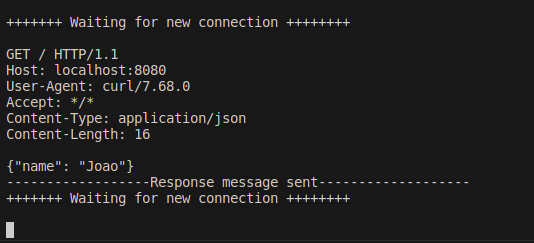

# restapi.c
Ever wondered what a Rest API would look like in C? This project aims to answer that.

# Running locally on linux OS systems
```
gcc -o server server.c
```
```
./server
```

# Testing
1. After running the server, it's quite simples to test it, just run:
```
curl -X GET -d '{"name": "your-name-here"}' -H "Content-Type: application/json" http://localhost:8080
```


# Next steps
1. Add parser for the request
2. Add the data structures for the incoming data
3. Add the logic for the response, for now the response it's mocked on the code
4. Add logic for different methods in the HTTP protocol
5. Create routing logic 